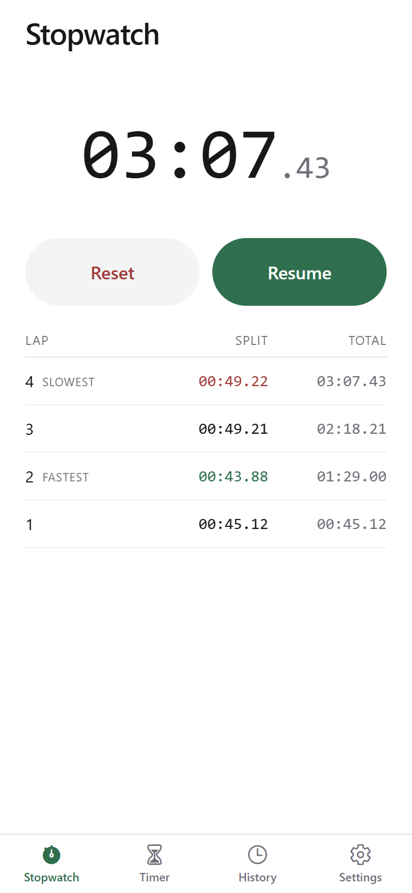
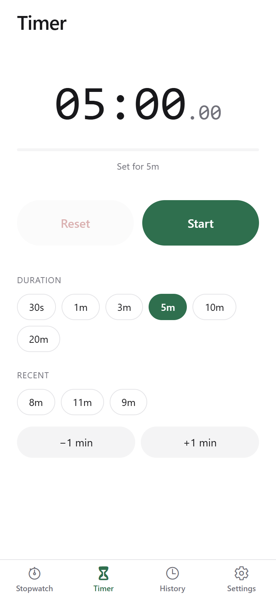
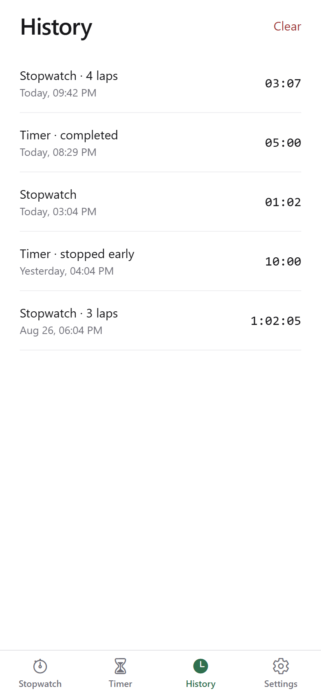
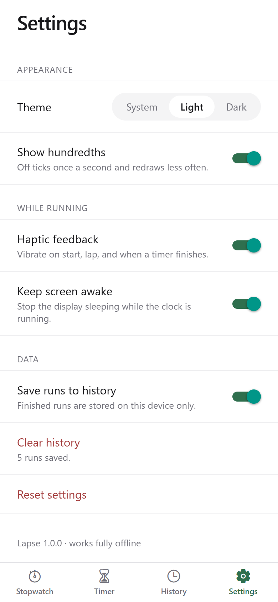
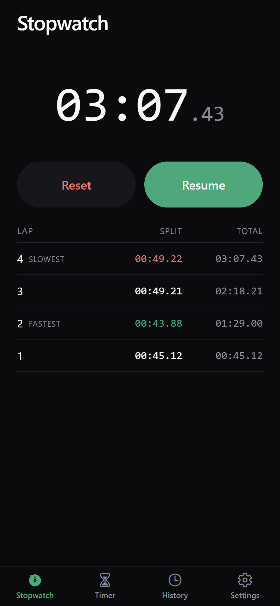
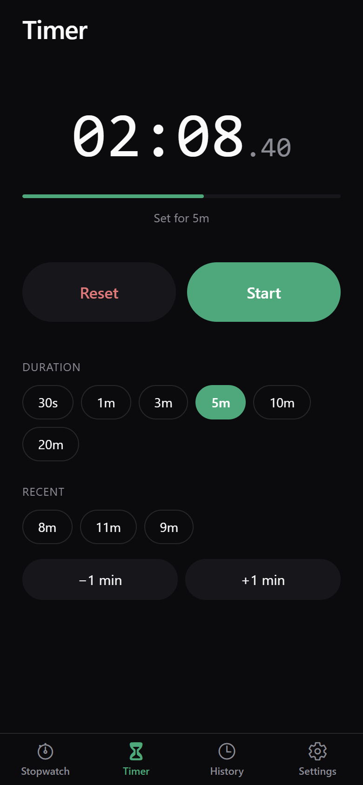
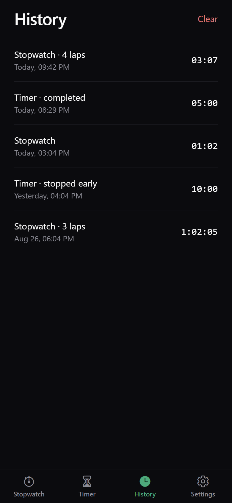
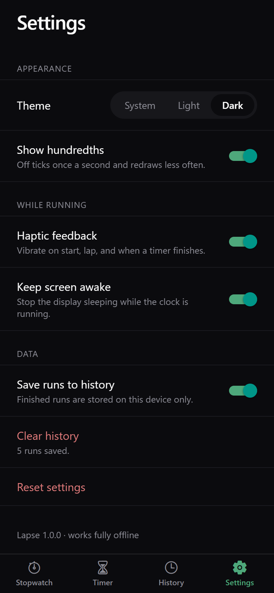

# Lapse — Stopwatch & Timer

A small stopwatch and countdown timer for Android and iOS, built with React Native and Expo. No accounts, no network, no ads. It opens on the stopwatch and starts on the first tap.

Everything it records stays on the device. Close the app mid-run and reopen it, and the clock is still where you left it, because timing is anchored to the wall clock rather than to a tick counter.

Built for the Mobile Applications (UFCF7H-15-3) practical skills assessment, starting from the module's [RN-ExpoGo-Villa-Sample](https://github.com/Yasir5247/RN-ExpoGo-Villa-Sample) starter template.

## Screenshots

| Stopwatch | Timer | History |
| :---: | :---: | :---: |
|  |  |  |
| Laps with splits and running totals. | Presets, recent durations, ±1 min. | Saved runs, newest first. |

| Session detail | Settings | Dark theme |
| :---: | :---: | :---: |
|  |  |  |
| Pushed from History onto the stack. | Theme, precision, feedback, data. | Follows the system, or forced. |

<details>
<summary>Dark theme: timer, history, settings</summary>

| | | |
| :---: | :---: | :---: |
|  |  |  |

</details>

## Installation & running

Needs Node.js 20+, and [Expo Go](https://expo.dev/go) to run it on a phone. The project targets Expo SDK 54. Expo Go supports one SDK per release, so check yours matches if it refuses to load.

```bash
git clone https://github.com/kruleth/simple-stopwatch-timer.git
cd simple-stopwatch-timer
npm install
npx expo start
```

Scan the QR code with Expo Go, or press `a` / `i` / `w` for an Android emulator, iOS simulator, or the browser. `npm run android`, `ios` and `web` go straight to one platform.

Checks: `npm test`, `npm run typecheck`, `npm run lint`.

## Features

**Stopwatch.** Start, stop and resume, with elapsed time computed from timestamps so a long pause adds nothing to the clock. Laps record a split and a running total each, and the fastest and slowest are marked once there are three to compare. A run left going keeps counting while the app is closed. Reset files the run into History rather than discarding it.

**Timer.** Presets from 30 seconds to 20 minutes, plus ±1 minute for anything between. The last three custom durations you actually ran get their own chips, so a 7-minute timer is one tap the second time. Pause and resume from the exact remaining time. Finishing buzzes and shows "Time's up", and a countdown that ends while the app is closed shows as finished on next launch instead of firing the alert late.

**History.** Every finished run, newest first, labelled *Today* / *Yesterday* / a short date. Tap one for the full lap breakdown. Delete a single run or clear all, both behind a confirmation. Capped at 200 runs.

**Settings.** Theme (system, light or dark), hundredths on or off, haptics, keep-screen-awake, and whether runs are saved at all.

**Throughout.** Fully offline, with no network code anywhere. Every control is labelled, and the readout announces a spoken duration ("3 minutes, 7 seconds") rather than having a screen reader read changing digits many times a second.

## Technologies used

| | |
| --- | --- |
| **Framework** | React Native 0.81 on Expo SDK 54 |
| **Language** | TypeScript, `strict` |
| **Navigation** | Expo Router 6, file-based, four bottom tabs plus a stack |
| **State** | React Context API (`SettingsProvider`, `HistoryProvider`) |
| **Persistence** | AsyncStorage, behind a typed wrapper |
| **Styling** | NativeWind 4 (Tailwind CSS for React Native) |
| **Device APIs** | `expo-haptics`, `expo-keep-awake`, `@expo/vector-icons` |
| **Testing** | Jest with the `jest-expo` preset |
| **Tooling** | ESLint (`eslint-config-expo`), Prettier |

No API is used. The app works with the device in aeroplane mode.

The stopwatch stores banked milliseconds plus the timestamp the current segment began; the timer stores the timestamp it will finish. Both derive elapsed and remaining from `Date.now()` on each render, so a throttled or dropped interval costs nothing in accuracy.

## Testing & error handling

`npm test` runs 49 unit tests across 3 suites, covering pause and resume cycles not losing time, laps summing to the elapsed total, a timer resuming from its paused remainder, a countdown flooring at zero, a backwards clock jump being clamped, and the recent-duration list capping and de-duplicating.

Storage reads never throw. A missing or corrupt entry resolves to a default and the bad entry is dropped. Haptics and the wake lock are fire-and-forget, since neither is worth interrupting a press over. Destructive actions confirm first.

Manual testing covered every screen and control on the Expo web target in both themes at 390×844, and the app is confirmed running in Expo Go on a physical iPhone. The Android bundle compiles cleanly, but the app has not been run on Android hardware because no device was available, so Android behaviour is unverified. `npx expo-doctor` passes 18/18.

## Known issues & future improvements

- **No notification when a timer finishes in the background.** It buzzes and shows "Time's up" when you next open the app, but cannot alert you while closed. Needs `expo-notifications` and a permission prompt.
- **No sound on completion.** Haptics only, so a timer ending face-down and silent is easy to miss.
- **No exact duration entry.** Presets plus ±1 minute cover most cases but you cannot type 7:30. A numeric pad is the obvious fix.
- **Haptics do nothing on the web target**, as expected.

Next: local notifications and a completion sound, custom duration entry, labelling runs so History is browsable, and component-level tests to complement the pure-function ones.

## Reflection

The brief I set myself was *nothing that does not earn its place*. The starter template ships with MobX, React Query, axios, i18next and camera access, all sensible for a large app and dead weight for a stopwatch. I kept its foundations and stripped the rest, leaving a dependency list short enough to justify line by line.

The most useful decision was pulling the timing rules out of the hooks into pure functions. It began as a testability concern and became a correctness one. Writing `startTimer` and `pauseTimer` as `(state, now) => state` made it obvious that resume has to restore the *paused remainder* rather than the original duration, and that a timer sitting at zero should start a fresh countdown instead of finishing instantly. Both are easy to get wrong inside a component and easy to see in a two-line function.

The lesson that cost most was that *the web target is not the platform*. Everything I had verified, every screen and control in both themes, was verified in a browser, and none of it told me the app could not launch on a phone at all. The starter's pinned SDK 53 was long past what Expo Go supports, and finding that meant going up to SDK 57 and back down to 54. The detour paid for itself. The newer toolchain's React Compiler lint rules caught a `setState` called synchronously in an effect, a ref mutated during render, and `Date.now()` called during render. Fixing the last one produced the best change in the codebase: the timer's completion is now a single `setTimeout` aimed at the deadline rather than a check re-run on every repaint.

## Licence

Coursework submission. The starter template it derives from is MIT-licensed.
